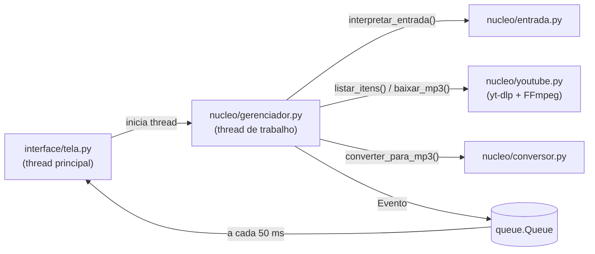

# 🎵 Baixador de Músicas

Aplicativo desktop em Python que baixa músicas do YouTube (e de [centenas de outros sites suportados pelo yt-dlp](https://github.com/yt-dlp/yt-dlp/blob/master/supportedsites.md)) e **já entrega tudo em MP3**, com capa e tags. Também converte para MP3 arquivos de áudio/vídeo que já estão no seu computador.


<!-- Tire um print da janela, salve como docs/tela.png e descomente a linha abaixo -->
<!--  -->

---

## ✨ Funcionalidades

- **MP3 direto**: cada download é convertido automaticamente para MP3 (128, 192, 256 ou 320 kbps).
- **Capa e tags**: grava a miniatura do vídeo como capa do álbum e preenche título/artista/data.
- **Vários formatos de entrada**, um por linha, podendo misturar:
  - link de vídeo ou de YouTube Music;
  - link de playlist (baixa todas as faixas);
  - só o nome da música (`Legião Urbana - Tempo Perdido`) — o programa pesquisa e baixa o primeiro resultado;
  - caminho de um arquivo `.txt` com uma lista.
- **Importar .txt**: o conteúdo aparece na caixa para você revisar antes de baixar (aceita UTF-8 e ANSI; linhas com `#` são comentários).
- **Converter arquivos do PC**: `.mp4`, `.m4a`, `.webm`, `.wav`, `.flac`, `.ogg`, `.opus`, `.mkv`… → MP3.
- **Pular** a música atual ou **cancelar tudo** a qualquer momento, sem deixar arquivos `.part` para trás.
- **Não baixa de novo** o que já está na pasta (opcional).
- **Links de Mix/Rádio** (`list=RD…`) baixam só a música do link, e não 50 faixas aleatórias.
- **Lembra suas preferências** (pasta, qualidade, opções) entre execuções.
- **Mensagens de erro em português** (vídeo privado, restrição de idade, bloqueio 403, sem internet…).
- **FFmpeg embutido**: não precisa instalar nada para gerar MP3.

## 📥 Uso rápido (usuário final)

1. Baixe o `DownloaderMusic.exe` na página de [Releases](../../releases).
2. Abra o programa, cole links ou nomes de músicas (um por linha).
3. Escolha a pasta e a qualidade e clique em **⬇ BAIXAR EM MP3** (ou `Ctrl+Enter`).

> O Windows SmartScreen pode avisar que o app é de "editor desconhecido", pois o `.exe` não é assinado digitalmente. Clique em **Mais informações → Executar assim mesmo**.

Exemplo de `lista.txt`:

```text
# Minha playlist de estudo
Guns N Roses - Patience
AC/DC - Thunderstruck
https://www.youtube.com/watch?v=dQw4w9WgXcQ
https://www.youtube.com/playlist?list=PL...
```

## 🛠️ Rodando a partir do código-fonte

Pré-requisito: **Python 3.10 ou mais novo** (testado no 3.12 e 3.13).

```bash
git clone https://github.com/SEU-USUARIO/baixador-musicas.git
cd baixador-musicas

python -m venv .venv
# Windows:
.venv\Scripts\activate
# Linux/macOS:
source .venv/bin/activate

pip install -r requirements.txt
python principal.py
```

### Sobre o FFmpeg (conversão para MP3)

O FFmpeg é o programa que faz a conversão. O app procura um FFmpeg nesta ordem:

1. Dentro do próprio `.exe` (quando gerado pelo `DownloaderMusic.spec`);
2. `ffmpeg.exe` ao lado do programa ou nas pastas `vendor/`, `ffmpeg/`, `ffmpeg/bin/`, `bin/`;
3. No `PATH` do sistema (ex.: instalado com `winget install Gyan.FFmpeg`);
4. No pacote pip **`imageio-ffmpeg`**, que já vem no `requirements.txt` — por isso normalmente funciona sem você fazer nada.

O rodapé da janela mostra se o FFmpeg foi encontrado.

### Sobre o Deno (recomendado para o YouTube)

Desde o fim de 2025 o YouTube exige que o yt-dlp execute código JavaScript para liberar alguns formatos. Para isso ele usa o **Deno**. O `requirements.txt` instala o Deno via pip (`yt-dlp[default,deno]`) e o `build.bat` o embute no `.exe`. Se preferir instalar no sistema: `winget install DenoLand.Deno`.

Sem Deno o programa ainda abre e converte arquivos, mas downloads do YouTube podem falhar com erros de "formato indisponível" ou 403.

## 📦 Gerando o executável (.exe)

No Windows, dentro da pasta do projeto:

```bat
build.bat
```

O script cria o `.venv`, instala as dependências, **roda os testes** e gera `dist\DownloaderMusic.exe` (arquivo único, sem console, com FFmpeg e Deno embutidos). Use `build.bat leve` para um `.exe` menor sem o Deno.

Opcional: coloque um `icone.ico` na raiz do projeto para personalizar o ícone.

## 🧱 Estrutura do projeto

```text
baixador-musicas/
├── principal.py            # ponto de entrada: configura log e abre a janela
├── interface/
│   └── tela.py             # janela (CustomTkinter); só ela mexe em widgets
├── nucleo/                 # lógica sem interface (testável)
│   ├── entrada.py          # interpreta links, nomes e .txt
│   ├── youtube.py          # yt-dlp: listar playlists e baixar em MP3
│   ├── conversor.py        # converte arquivos locais com FFmpeg
│   ├── gerenciador.py      # fila, pular/cancelar, eventos para a interface
│   ├── ferramentas.py      # acha FFmpeg/Deno, pastas do sistema
│   └── configuracoes.py    # salva preferências em JSON
├── tests/                  # testes automatizados (pytest)
├── vendor/                 # (opcional) ffmpeg.exe / deno.exe para embutir
├── DownloaderMusic.spec    # receita do PyInstaller
├── build.bat               # gera o .exe em um comando
├── requirements.txt        # dependências de execução
├── requirements-dev.txt    # + pytest e PyInstaller
└── .github/workflows/ci.yml
```

### Como funciona por dentro



- O **Tkinter não é thread-safe**: se uma thread secundária altera um widget, a janela pode travar ou fechar sozinha. Por isso o gerenciador nunca toca na interface; ele só publica `Evento`s numa `queue.Queue`, que a janela consome com `after()`.
- **Pular/cancelar** usam `threading.Event`. Os *hooks* de progresso do yt-dlp checam esses eventos e levantam `DownloadCancelled`, que o yt-dlp sempre repassa (mesmo com `ignoreerrors`); em seguida os arquivos temporários são apagados.
- Cada download faz `extract_info(download=False)` primeiro. Assim o app descobre o título real (útil nas buscas), calcula o nome final do `.mp3` e pula o que já existe **antes** de baixar.
- A conversão é feita pelos pós-processadores do yt-dlp: `FFmpegExtractAudio` (MP3) → `FFmpegMetadata` (tags) → `EmbedThumbnail` (capa).

## ✅ Testes

```bash
pip install -r requirements-dev.txt
python -m pytest -v
```

Os testes cobrem a interpretação de entradas (links, Mix, `.txt` em UTF-8/ANSI, duplicadas), a montagem dos pós-processadores, as mensagens de erro e a conversão real de um áudio com FFmpeg.

No GitHub, o workflow `.github/workflows/ci.yml` roda os testes a cada push. Ao criar uma **tag de versão** (`v4.0.0`), ele também gera o `.exe` no Windows e o publica automaticamente na página de Releases.

## 🚀 Publicando no GitHub (passo a passo)

1. Crie uma conta em <https://github.com> e instale o Git: <https://git-scm.com/download/win>.
2. Configure seu nome e e-mail (só na primeira vez):

   ```bash
   git config --global user.name "Seu Nome"
   git config --global user.email "seu-email@exemplo.com"
   ```

3. No GitHub, clique em **New repository**, dê o nome `baixador-musicas`, deixe **sem** README/.gitignore/licença (o projeto já tem) e clique em **Create repository**.
4. Na pasta do projeto:

   ```bash
   git init
   git add .
   git status              # confira: NÃO podem aparecer .venv/, build/, dist/ nem .mp3
   git commit -m "Baixador de Músicas v4.0.0"
   git branch -M main
   git remote add origin https://github.com/SEU-USUARIO/baixador-musicas.git
   git push -u origin main
   ```

   Na hora do `push` o Git pede login: use o navegador ou um *Personal Access Token* (GitHub → Settings → Developer settings → Tokens).

5. Para publicar o `.exe`, crie uma tag — o GitHub Actions gera e anexa o executável na Release:

   ```bash
   git tag v4.0.0
   git push origin v4.0.0
   ```

   Acompanhe em **Actions**; em alguns minutos o `.exe` aparece em **Releases**. (Se preferir fazer à mão: *Releases → Draft a new release*, escolha a tag e arraste o `dist\DownloaderMusic.exe`.)

6. Atualizações futuras:

   ```bash
   git add .
   git commit -m "Descreva o que mudou"
   git push
   ```

> ⚠️ **Nunca versione** `.venv/`, `build/`, `dist/` nem as músicas baixadas. O `.gitignore` já cuida disso. Se algo assim já entrou num commit: `git rm -r --cached .venv build dist` e faça um novo commit.

## 🧯 Problemas comuns

| Sintoma | Solução |
|---|---|
| "FFmpeg não encontrado" | `pip install imageio-ffmpeg` ou `winget install Gyan.FFmpeg`, ou coloque `ffmpeg.exe` ao lado do programa. |
| Erro 403, "formato indisponível" ou "not a bot" | Atualize o yt-dlp: `pip install -U "yt-dlp[default,deno]"` e gere o `.exe` de novo. Confira se o Deno aparece como OK no rodapé. |
| "Restrição de idade" ou "vídeo privado" | O vídeo exige login; o app não usa sua conta. |
| Antivírus acusa o `.exe` | Falso positivo comum em executáveis do PyInstaller. O `.spec` já desativa o UPX para reduzir isso. |
| Quero ver detalhes do erro | Log em `%APPDATA%\BaixadorMusicas\baixador.log` (Windows) ou `~/.config/baixador-musicas/baixador.log`. |

O YouTube muda com frequência; na maioria das vezes, **atualizar o yt-dlp resolve**.

## 📝 Histórico de versões

### v4.0.0
- Conversão para MP3 garantida: FFmpeg localizado automaticamente e embutido no `.exe`.
- Capa do álbum e tags ID3 no MP3; qualidade 256 kbps adicionada.
- Nova função: converter arquivos do PC para MP3.
- Caixa de texto com várias linhas (links + nomes + `.txt` misturados).
- Interface thread-safe (fim de travamentos aleatórios) e redimensionável.
- Uma linha por música no histórico, com status claro (antes surgiam linhas duplicadas).
- "Pular" agora realmente pula, não conta como sucesso e apaga os temporários.
- Botão "Cancelar tudo"; fechar a janela encerra os downloads.
- Contagem correta de sucessos/erros e resumo final.
- Links dentro do `.txt` não são mais pesquisados como texto.
- Pasta padrão em `Música\Baixador de Musicas` (antes dependia de onde o `.exe` era aberto).
- Preferências salvas, log em arquivo, testes automatizados e CI no GitHub.

### v3.2
- Versão inicial com download de vídeos, playlists e listas `.txt`.

## ⚖️ Aviso legal

Este projeto é para fins educacionais e para uso com conteúdo que você tem o direito de baixar (músicas próprias, domínio público, licenças Creative Commons etc.). Baixar material protegido por direitos autorais sem autorização pode violar a lei e os Termos de Serviço do YouTube. A responsabilidade pelo uso é de quem o utiliza.

## 📄 Licença

Distribuído sob a licença MIT — veja [LICENSE](LICENSE).

Feito com Python, [yt-dlp](https://github.com/yt-dlp/yt-dlp), [FFmpeg](https://ffmpeg.org/) e [CustomTkinter](https://github.com/TomSchimansky/CustomTkinter).
